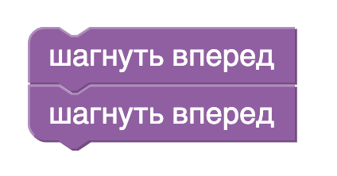
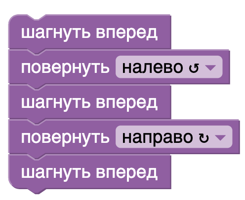
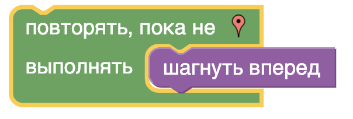
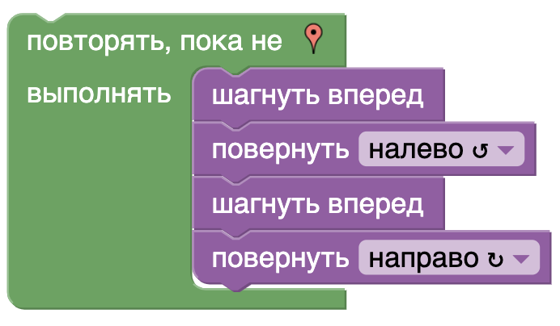
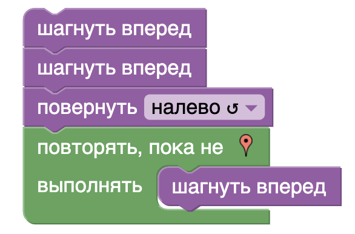
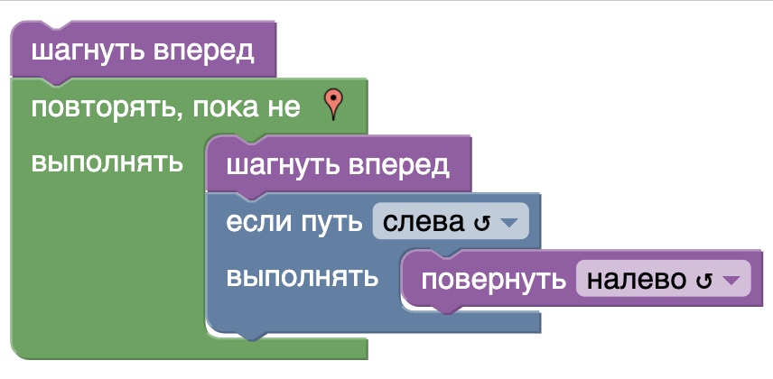
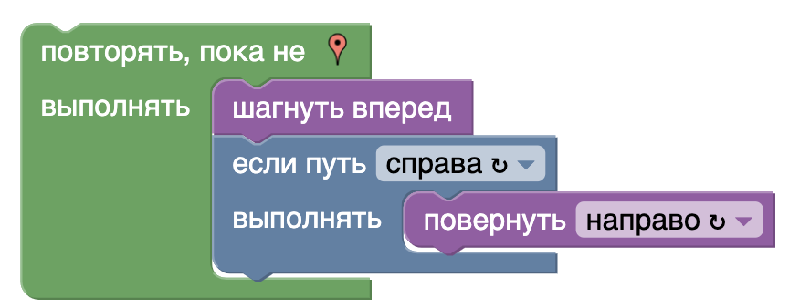
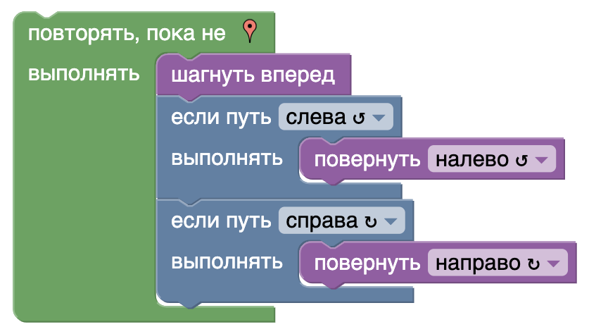
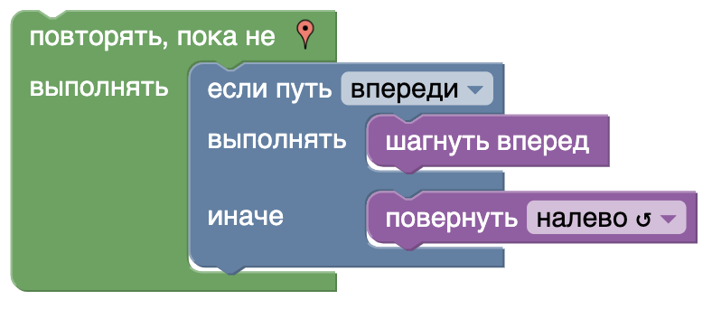
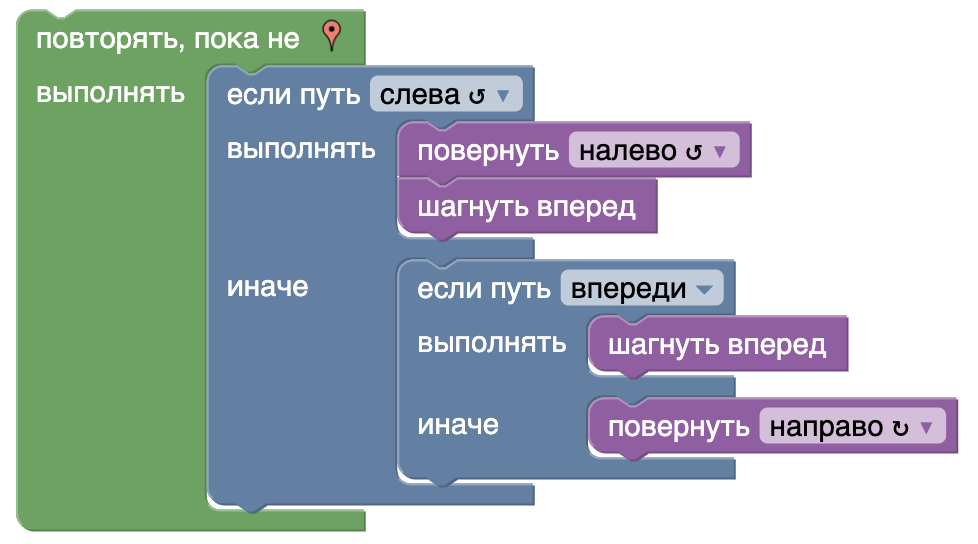

# Игра "Лабиринт"
В данной игре перед игроком стоит задача написать программу, выполнив которую человечек (путник) на игровом поле пройдет из начального поля в конечное.
## Задание №1
В данном задании разбираем то, что блок - задает определенное действие:  

## Задание №2
В двнном задании - разбираем повороты путника.  

## Задание №3
В данном задании разбираем использование цикла (пока не *, повторять) с простой командой

## Задание №4
В данном задании разбираем использование цикла (пока не *, повторять) с несколькими командами    

## Задание №5
Показываем, что можно использовать не только цикл, но и команды перед ним.  

## Задание №6
К циклу - добавляем оператор выбора (ветвление).

## Задание №7
В ветвлении изменяем условие (выбираем параметр).

## Задание №8
Используем два ветвления с разным значением параметра

## Задание №9
Используем ветвление с двумя ветвями (истинной и ложной)

## Задание №10
Делаем сложное алгоритмическое задание.

